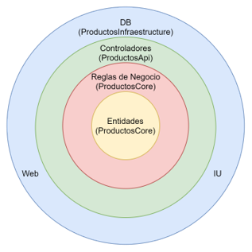
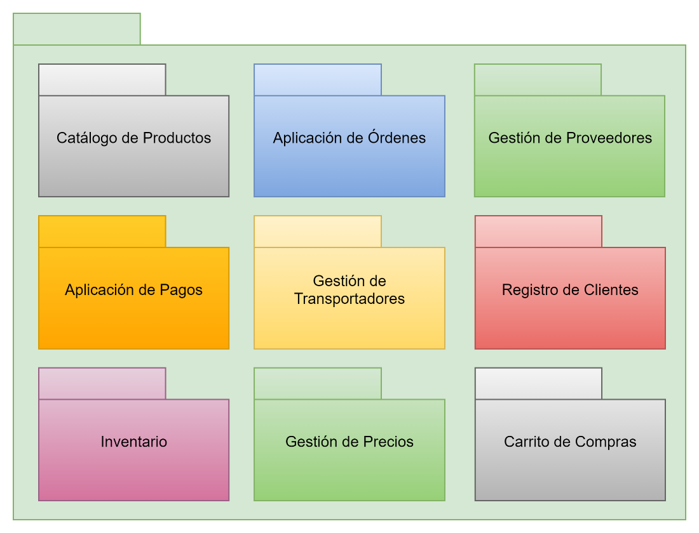

||||
| :- | :-: | -: |

Proyecto de Implementación Centrado en la Arquitectura

Grupo The One Team

Alberto Algarín Marino

Carolina Jiménez Arboleda

Carlos Alberto Arango Buitrago

Jhon Alexander Pineda Arias

Eduard Rafael Torres Cueto

PONTIFICIA UNIVERSIDAD JAVERIANA 

BOGOTÁ 

2021

# Contenido
TOC \o "1-3" \h \z \u[1.	Visión de arquitectura  PAGEREF _Toc73543186 \h 3](#_Toc73543186)

[2.	Requerimientos	 PAGEREF _Toc73543187 \h 3](#_Toc73543187)

[2.1 Requerimientos Generales	 PAGEREF _Toc73543188 \h 3](#_Toc73543188)

[1.	Requerimientos Técnicos	 PAGEREF _Toc73543189 \h 4](#_Toc73543189)

[3.	Propuesta de mejora de proceso	 PAGEREF _Toc73543190 \h 5](#_Toc73543190)

[3.1.	Proceso de la generación de la orden	 PAGEREF _Toc73543191 \h 5](#_Toc73543191)

[Proceso Actual	 PAGEREF _Toc73543192 \h 5](#_Toc73543192)

[Proceso To Be	 PAGEREF _Toc73543193 \h 5](#_Toc73543193)

[3.2.	Proceso para integración con los proveedores	 PAGEREF _Toc73543194 \h 10](#_Toc73543194)

[4.	Plataforma de servicios - aproximación de la solución	 PAGEREF _Toc73543195 \h 12](#_Toc73543195)

[Decisiones de arquitectura	 PAGEREF _Toc73543196 \h 12](#_Toc73543196)

[Tradeoff  PAGEREF _Toc73543197 \h 14](#_Toc73543197)

[Patrones / Estrategias de diseño	 PAGEREF _Toc73543198 \h 15](#_Toc73543198)

[5.	ATAM	 PAGEREF _Toc73543199 \h 29](#_Toc73543199)

[6.	Diagramas	 PAGEREF _Toc73543200 \h 30](#_Toc73543200)

[Diagrama de servicios	 PAGEREF _Toc73543201 \h 31](#_Toc73543201)

[Diagrama de Despliegue	 PAGEREF _Toc73543202 \h 33](#_Toc73543202)

[Diagrama de solución de proveedores	 PAGEREF _Toc73543203 \h 33](#_Toc73543203)

Tabla de figuras

1. ## Visión de arquitectura 

Con el fin de soportar la operación de K’all sonys, se propone una arquitectura con estilo de microservicios, la cual se diseñó a partir de un proceso de event storming, y con DDD se definieron los diferentes bounded contexts, esta arquitectura favorecerá particularmente los atributos disponibilidad y particionamiento, pero sacrificará la consistencia según el teorema CAP. Nuestro MVP permitirá todo el proceso de creación de la orden sin contemplar el servicio post-venta.

La interfaz de usuario para el e-commerce construida en angular con un diseño responsive, delegará la renderización grafica al cliente lo cual ahorra costos de procesamiento en el servidor, mediante este interfaz será posible registrarse como cliente, buscar productos propios de K’all sonys y de sus proveedores, llenar un carrito de compra y finalmente realizar el pago de la orden mediante tarjeta de crédito. La orden es recibida por un api Gateway y es direccionada al servicio de ordenes el cual generara un numero de orden que se entrega al usuario y posteriormente se enviara la orden a una cola para que sea procesada de forma asíncrona y evitar que el cliente tenga que esperar por el procesamiento completo. La cola de estilo FIFO favorecerá la escalabilidad del sistema ya que puede encolar muchas peticiones en las horas pico sin necesidad de sobrecargar la base de datos de órdenes, los inventarios y los servicios de autorización de pagos.

Teniendo en cuenta que cada proveedor puede tener diferentes contratos para el intercambio de información, se creó una capa de anticorrupción que mediante plantillas json transforman la información en diferentes formatos json y xml a la estructura interna de productos de K’all sonys. De forma similar se podrán enviar las órdenes de compra a los proveedores con una plantilla de transformación según el contrato definido por cada proveedor. Ahora conociendo de antemano que el 65% de la carga será la búsqueda de productos, se estableció una vista materializada del inventario en una base de datos NoSQL para favorecer el rendimiento de las búsquedas sin impactar los repositorios transaccionales.

1. ## Requerimientos

A continuación, se listan los requerimientos solicitados por la compañía K’ all Sonys

### 2.1 Requerimientos Generales

|**Número Requerimiento**|**Descripción**|
| :- | :-: |
|REQ 1|
Revisión del proceso TO-BE, análisis de su validez y propuesta de un nuevo proceso 

|
|REQ 2|Mejora y automatización de las actividades del proceso en su máxima extensión|
|REQ 3|
Capacidad de respuesta de las funcionalidades del negocio para temporadas altas como lo son eventos deportivos (Mundiales y Olímpicos), Black Friday, Cyber-Monday y navidad 

|
|REQ 4|Soporte de canales de atención a través de la Web, dispositivos móviles y nuevas interfaces de interacción (smartwatches, Amazon Echo, Google Home, Start TVs, ...) e integración de procesos B2B|
|REQ 5|Capacidad de agregar nuevos proveedores/convenios/alianzas sin que sea traumático|
|REQ 6|Capacidad de cambiar condiciones o reglas de negocio sin tener que re-desplegar el sistema|
|REQ 7|Soporte de recolección de información de navegación de los usuarios y servidores para futuro análisis (Tagging) |
|REQ 8|Soporte de operación del negocio 24x7x365, se espera disponibilidad del 99.999|
|REQ 9|Implementar el mecanismo de subasta inversa para todos los proveedores|

1. ### Requerimientos Técnicos

|**Número Requerimiento**|**Descripción**|
| :-: | :-: |
|REQ\_T 1|El sitio debe soportar Full-Text Search en la búsqueda de productos. Debe soportar resultados similares para nunca mostrar 0 resultados |
|REQ\_T 2|El sitio debe ser responsive, este requerimiento tiene prioridad sobre cualquier desarrollo de app móvil|
|REQ\_T 3|Se espera que el sitio para Colombia atiende alrededor de 10 millones de vistas mensuales.|
|REQ\_T 4|El contenido digital (Imágenes, Videos Cortos, etc) juega un factor relevante en el sitio, en promedio este representa alrededor del 60% de lo que se despliega en la página, sin contar JS o Data-Driven Content, por lo que se requiere una solución que permita manejar este contenido, cachearlo y hacerlo disponible de manera cercana al usuario que lo solicita.|
|REQ\_T 5|El 65% de todas las peticiones de los usuarios son sobre consultas al catálogo de productos que ofrece el sitio.|
|REQ\_T 6|Para la salida de los mercados de Perú, Chile, México (Segundo año de operación de la plataforma), más la aplicación en la cobertura de operación local, se espera un crecimiento de 2.4x, es decir 24 millones de visitas mensuales.|
|REQ\_T 7|Las peticiones de consulta de productos no deben tardar más de 1.5 segundos promedio por usuario.|
|REQ\_T 8|Ninguna petición puede tardar más de 3 segundos por usuario. Métricas de e-commerce han revelado que cuando un usuario espera por más de 3 segundos se puede llegar a perder un 60% de las ventas, mientras que cuando se demora menos de 1 segundo se puede completar alrededor de un 90% de las ventas.|
|REQ\_T 9|El sistema debe ser capaz de crecer y decrecer dinámicamente según la demanda. Este caso en especial se ve reflejado en las fechas como Cyber-Mondays, Black-Fridays y otros en donde la demanda por los servicios puede crecer hasta 250% sobre la operación normal.|
|REQ\_T 10|El sistema debe poder satisfacer los incrementos de la demanda sin sacrificar su capacidad de respuesta, en otras palabras, atender a 100 usuario o 100 mil usuarios debería ser equivalente.|
|REQ\_T 11|El servicio de pagos debe soportar pagos por VISA, MasterCard, AMEX, Discover y PayPal. Para el caso de Colombia se deben aceptar pagos por PSE adicionalmente a los mencionados.|
|REQ\_T 12|Todo el tratamiento y procesamiento de la información de pagos debe cumplir con la norma PCI|
|REQ\_T 13|La aplicación en general debe estar libre de al menos el Top 10 de riesgos mencionados por OWASP, en su última edición. 14. |
|REQ\_T 14|El proceso de login debe soportar el mecanismo actual (email/password validado en la base de datos) mientras se realiza una migración a un mecanismo de IdP público (Google y Facebook). Actualmente hay alrededor de 12 mil usuarios registrados|

1. ## Propuesta de mejora de proceso 
##
1. ## Proceso de la generación de la orden

En la siguiente sección se presenta el proceso que actualmente tiene la compañía para la generación de órdenes y el proceso al cual se llega con la solución:
### Proceso Actual

En el proceso actual, los clientes deben establecer contacto con personas del equipo de K’ all Sony para adquirir los productos y así mismo el equipo de K’all Sony debe contactar a sus proveedores para poder adquirir los productos solicitados por los diferentes clientes, lo cual hace que este proceso actualmente se complejo y tome más tiempo para ejecutarse. A continuación, se presenta el flujo que tiene la compañía para la generación de las órdenes:

*Figura  SEQ Figura \\* ARABIC 1. Proceso actual de generación de orden*
### Proceso To Be

Con la solución implementada, se busca ofrecer un canal digital a los clientes que les permita autogestionarse y realizar sus compras de productos de la compañía sin tener que acudir a realizar llamadas a la compañía que les puede tomar mucho tiempo, teniendo en cuenta s las validaciones que deben hacerse por parte de diferentes personas para poder generar una orden de compra. A través del E-commerce, las personas podrán seleccionar los productos, realizar los pagos con sus productos financieros e indicar el lugar donde desea recibir sus productos sin tener contacto con ninguna persona, esto le permitirá adquirir sus productos de forma más rápida. Adicionalmente, esto le permitirá a la compañía llegar a más personas y aumentar la venta de sus productos y expandirse a nuevos lugares en el futuro. A continuación, se presenta el nuevo flujo para la generación de las órdenes en los siguientes diagramas:

`  `REF \_Ref73485493 \h  \\* MERGEFORMAT Figura 2. Proceso de generación de orden de compra.

` `REF \_Ref73485495 \h  \\* MERGEFORMAT Figura 3.  Proceso de colocar orden

` `REF \_Ref73485497 \h  \\* MERGEFORMAT Figura 4.  Proceso de confirmar orden
||||
| :- | :-: | -: |

*Figura  SEQ Figura \\* ARABIC 2. Proceso de generación de orden de compra.*

*Figura SEQ Figura \\* ARABIC3.  Proceso de colocar orden*

*Figura  SEQ Figura \\* ARABIC 4.  Proceso de confirmar orden*

Teniendo en cuenta los diagramas previamente presentados, con la solución se verán impactadas principalmente las capacidades que se presentan en la  REF \_Ref73485455 \h  \\* MERGEFORMAT Tabla 1.Capacidades impactadas con el nuevo proceso REF \_Ref73485403 \h  \\* MERGEFORMAT , para las cuales se describe cuál fue el cambio realizado

|**Identificador**|**Nombre**|**Descripción del cambio**|
| :-: | :-: | :-: |
|CAP\_1|Gestión de servicios de mensajería|Esta capacidad es modificada. Se modifica la forma en que actualmente se realiza esta gestión, ya que en este proceso el director de distribución es quien manualmente selecciona el servicio de mensajería a utilizar. Con la modificación esta selección se realizará de forma automática a través de la integración que se realizará entre el e-commerce y los proveedores de mensajería.|
|CAP\_2|Gestión de inventarios|Esta capacidad es modificada. Se modifica el sistema que permite la gestión del catálogo de productos que ofrece la compañía. Y la forma en la cual se descargan los productos del inventario. Anteriormente era una persona que realizaba esto de forma manual. Con la nueva solución la API de órdenes se integrará con la API de inventarios para actualizar automáticamente los inventarios sin la intervención humana.|
|CAP\_3|Gestión de aprobación de órdenes|
Esta capacidad se agrega en la capacidad de gestión de órdenes, debido a que actualmente este proceso de aprobación se realiza de forma manual, y con la solución del E-commerce, se automatiza el proceso. Para ello, la API encargada de las órdenes se encarga de validar de forma automática:

1- La disponibilidad de los productos

2- Que el pago se haya realizado exitosamente

Si estas dos condiciones se cumplen se acepta la orden y posteriormente se descarga del inventario. En caso de presentarse algún inconveniente durante la descarga de los inventarios, dicha orden queda en un estado Pendiente de inventario, para que posteriormente alguien la termine de procesar.
|
|CAP\_4|Gestión de negociación de proveedores|Esta capacidad es modificada. Se modifica la forma en que actualmente se realiza esta gestión, ya que en este proceso el director de compras es quien manualmente selecciona a qué fabricante se le comprará el producto. Con la solución esta selección se realizará de forma automática a través de la integración del e-commerce con los proveedores. En este caso el cliente es quien se encargará de seleccionar el producto que comprará, de acuerdo al precio que más le convenga.|
|CAP\_5|Gestión de ventas online|Se ofrecerá un nuevo canal mediante el cual los clientes podrán realizar compras Online sin necesidad de hacerlas a través de correo electrónico o a través de llamadas telefónicas.|
|CAP\_10.3|Gestión de pagos|Esta capacidad se elimina y se crea nueva capacidad y se propone que esta capacidad sea independiente del área comercial|
|CAP\_16.1|Gestión de envío email|Esta capacidad es modificada. Actualmente se ejecuta de forma manua. Con la solución del e-commerce la API encargada de las órdenes se encargará del envío de correos. Permitiendo hacer el envío automático de correos para notificar a los clientes la confirmación de sus órdenes de compra.|
|CAP\_21|Gestión de formas de pago|Esta capacidad se agrega ya que actualmente la gestión del pago se realiza a través del área comercial con la intervención del analista de ventas. Con la solución esta gestión se realizará de forma automática gracias a la integración del E-commerce con una pasarela de pagos, además de que se ofrecerá la opción de pagos contarjetas de créditos. Esta capacidad permitirá a los clientes realizar el pago de sus productos de forma automática y sin intervención humana.|
*Tabla  SEQ Tabla \\* ARABIC .Capacidades impactadas con el nuevo proceso*

1. ## Proceso para integración con los proveedores

Para la gestión de los proveedores se creó un base datos que almacena los proveedores alianzas o convenios que tiene la compañía K’ all Sonys y con los cuales se integrará el e-commerce para consultar los productos y generar las órdenes en  donde se almacena información de cada proveedor incluyendo el contrato de los servicios que se consumirán para obtener los productos y generar las órdenes, los cuales son almacenados como plantillas previamente adaptadas por una persona (En este caso el administrador el e-commerce) para que el API encargada del manejo de proveedores pueda mapear las solicitudes de los clientes a los proveedores y establecer la conexión con ellos y realizar la operación requerida. 

A continuación, se presenta los procesos para la obtención de productos y la generación de órdenes en los proveedores:

*Figura SEQ Figura \\* ARABIC5. Obtener productos proveedor.*

*Figura  SEQ Figura \\* ARABIC 6. Generar orden en proveedor.*
1. ## Plataforma de servicios - aproximación de la solución
### Decisiones de arquitectura 

#### *Estilo de Arquitectura de microservicios:*
Con la implementación de una arquitectura de microservicios orientada a cloud, se divide la solución en dominios de negocio los cuales pueden ser desarrollados y desplegados de forma independiente. Cada microservicio tiene su propio repositorio de datos para evitar bloqueos de datos en tablas relacionales. Este estilo de arquitectura favorece la escalabilidad, ya que cada microservicio puede escalar horizontalmente según el incremento de la carga; también se favorece la resilencia ya que el fallo en alguno de los servicios no implica una falla total del sistema.

#### *Sistema de Colas para procesamiento de ordenes:* 
Todas las ordenes son recibidas por una cola para que se realice procesamiento asíncrono, de esta manera el cliente únicamente recibe el número de orden, y espera por la confirmación de procesamiento de la orden. La col se implementó con el componente SQS de AWS tipo FIFO, con semántica de entrega Exactamente una vez. Esta semántica garantiza que cada orden se procese exactamente una vez. Además, la cola despacha ordenes de forma secuencial para evitar saturar el sistema que procesa las órdenes. La cola favorece el atributo de escalabilidad, ya que el servicio de ordenes puede recibir una alta cantidad de ordenes sin impactar el tiempo de respuesta al usuario final.

#### *Circuit Breaker para comunicación entre dominio de productos y dominio de proveedores:*
En la eventualidad que exista un problema en la obtención de los productos desde los servicios federados de los proveedores, un patrón circuit-breaker descartara la comunicación con los proveedores con el fin de que los usuarios puedan seguir consultando los productos de K’All sonys.

#### *Todas las ordenes se reciben, aunque el servicio de pagos en línea o servicio de proveedores no esté disponible:*
Cuando existen picos de peticiones en los servicios de órdenes y para evitar sobrecargar los servicios de los proveedores y de validación de pagos con tarjeta, todas las ordenes son recibidas por la cola FIFO en estado pendiente, luego todas las ordenes se procesan de forma secuencial y el cliente es informado del estado de su orden posteriormente.

#### *Concurrencia reservada para funciones lambda:*
Los microservicios van a ser desplegados en funciones lambda y uno de los principales problemas de esta aproximación es el arranque en frio cuando llevan un tiempo determinado sin usarse. El arranque en frio implica un tiempo de espera en los tiempos de respuesta de la lamba en su primera ejecución. Para mitigar un poco este inconveniente se propone la adquisición de concurrencia reservada, la cual garantiza que las lambdas estén listas para ser usadas con respuestas en milisegundos por determinada cantidad de horas al día.

#### *Base de datos NoSQL para consulta de productos y base de datos relacional para información transaccional:*
Para almacenar la información transaccional como los inventarios y las ordenes se utiliza un motor de base de datos relacional SQL Server, el cual garantiza la consistencia de la información, el rendimiento de estos motores no es el mas adecuado cuando existe alto volumen de peticiones y generan bloqueos que afectan otras peticiones. Para garantizar el rendimiento adecuado en las peticiones que son de búsqueda de productos se creó una base de datos en NoSQL dynamodb para almacenar una vista materializada del inventario, la cual genera mayor rendimiento en las operaciones que son de lectura sacrificando la consistencia y favoreciendo la escalabilidad.

#### *Autenticación con tokens JWT para algunas operaciones:*
Solo algunas operaciones van a requerir autenticación de los clientes, ya que el e-commerce permitirá la creación de pedidos sin estar registrados en el sistema. Para este propósito se generará un token JWT el cual se enviará en los headers cuando un cliente necesite consultar sus órdenes.

#### *Replicación de base de datos Always ON:*
Esta tecnología se propone para los servidores de base de datos relacionales SQL server, con una configuración de Publisher / listeners, esta estrategia permite tener replicas casi en tiempo real para garantizar la disponibilidad del sistema en caso de fallo del nodo principal.

#### *Utilización de Apigateway AWS Http:*
El api Gateway Http permite redireccionar las peticiones desde el cliente hacia las funciones lambda de manera mas eficiente ya que no necesita hacer transformaciones en los contratos.

#### *Despliegue en dos regiones de AWS:*
AWS permite el despliegue de una solución en varias regiones a la vez para favorecer la disponibilidad. Se propone desplegar la solución en la región de south america y us-east-2 para soportar los mercados de México, Perú, Chile y Colombia.

#### *Utilización de Ruta 53 para balancear los despliegues en cada región:* 
El componente Ruta 53 de AWS sirve para enrutar las peticiones de los usuarios a las regiones de AWS según los siguientes aspectos: localización geográfica, volumen de peticiones, latencia de respuesta de cada región, además realiza health check a cada una de regiones para descartarla en el caso que no esté respondiendo adecuadamente. Este componente favorece la disponibilidad y el particionamiento.

#### *Interfaz de Usuario de contenido estático en aplicación single page:*
La interfaz de usuario fue desarrollada en angular, para la cual se genera un paquete de contenido estático que puede desplegado en un servidor de contenido y se descarga una sola vez en el navegador del cliente. Este paquete una vez está en el navegador del cliente no requiere procesamiento en el servidor para renderizar la interfaz gráfica, todo el procesamiento es realizado en el navegador web del cliente, y únicamente necesitaría consumir la capa de APIs del back end. Esta aproximación para el desarrollo de la interfaz gráfica favorece el rendimiento en general de la interfaz de usuario y ahorra costos en adquisición de servidores para interfaz gráfica. Se propone realizar el despliegue del contenido estático en contenedores S3 de AWS.

### Tradeoff

#### *Sacrificar Seguridad Favorecer Usabilidad*
En el e-commerce será posible crear ordenes sin necesidad de registrarse y autenticarse, de esta manera se brindará una mejor experiencia al usuario, Únicamente para algunas funciones donde se expone información del usuario será requerida la autenticación.

#### *Sacrificar Seguridad Favorecer Rendimiento*
La aplicación al ser single page, de contenido estático expone los métodos el api en el navegador del cliente, estos métodos podrían ser explotados por atacantes, pero esta estrategia de despliegue favorece el rendimiento de la interfaz gráfica.

#### *Sacrificar Consistencia Favorecer Escalabilidad*
Como las ordenes no se crean directamente en la base de datos, sino que se envían a una cola para ser procesadas de forma asíncrona, el cliente recibe el número de orden, pero la orden aun está en la cola y puede demorarse un tiempo para ser validada y persistida en la base de datos, en este flujo el inventario podría estar inconsistente mientras la orden es procesada. Pero con esta estrategia el sistema es escalable para recibir muchas peticiones sin impacta el tiempo de respuesta en el usuario final.

De forma similar cuando un usuario crea un orden no estará disponible en su listado de ordenes de forma inmediata ya que es necesario esperar la sincronización.

#### *Sacrificar Consistencia Favorecer Disponibilidad*
Al tener múltiples repositorios de datos particularmente para el inventario, pueden existir lapsos de tiempo donde el inventario que se muestra a los clientes no es real, porque se realiza una actualización de forma asíncrona. 

#### *Sacrificar Testeabilidad Favorecer Resilencia*
En una solución con estilo de microservicios se hace más complejo realizar pruebas de integración en etapa de desarrollo por la cantidad de paquetes que deben estar ejecutándose correctamente, pero esta arquitectura favorece la resilencia, ya que si un dominio este caído no impactara el funcionamiento de otros dominios.

### Patrones / Estrategias de diseño
Durante el diseño y construcción de la aplicación se implementaron los siguientes patrones y 	estilos arquitectónicos:

- Canonical Data Model Pattern

¿Cómo se pueden minimizar las dependencias al integrar aplicaciones que utilizan diferentes 	formatos de datos?

Haciendo uso de Canonical Data Model se implementó un modelo de transformación de los 	formatos establecidos por los proveedores a un formato entendible y común para la	aplicación. Este modelo es independiente de la aplicación construida y dentro del proyecto los 	vamos a identificar como TraslatorJSLT y TraslatorXSLT.

- Repository Pattern

Este patrón nos permite encapsular y centralizar toda la lógica para acceder a las fuentes de datos, desacoplando la infraestructura o tecnología utilizada para acceso a los datos del modelo de dominio lo cual proporciona una mejor mantenibilidad.

- Arquitectura Limpia

El principio de la arquitectura limpia no permite separar el software en capas, cada capa con diferentes responsabilidades y al final tendremos un sistema con un alto grado de modificabilidad en el sentido que podremos actualizar o reemplazar componentes obsoletos sin muchas complicaciones como pe, la base de datos o el framework.

- Amazon Simple Queue Service  - SQS (Bróker)

Con SQS nos permite desacoplar y ajustar la escalabilidad de nuestros microservicios, además de enviar, almacenar y recibir mensajes en cualquier volumen sin que podamos tener perdidas de estos y sin la disponibilidad de servicios otros servicios que nos soporten.

- Arquitectura de Microservicios

Con los microservicios lo que se busca es desacoplar los componentes de un sistema que interactúan entre sí, garantizando ciertos atributos de calidad que permitirán que la aplicación sea mucho más fácil de mantener, tenga mejor desempeño, pueda soportar grandes cargas de peticiones, pueda tener cierta capacidad de recuperarse ante fallos entre otros.

- Materialized View Pattern

Es un patrón que nos ayuda a optimizar las consultas realizadas a aquellas entidades a las cuales se les hacen muchas peticiones durante la operatividad del sistema. Para este caso se usó una base de datos DynamoDB donde se establecen los productos como una vista materializada de los inventarios que nos ayuda a incrementar la escalabilidad del sistema.

- Domain Driven Design

Esta técnica nos permitió establecer los dominios para la construcción de los microservicios de la aplicación, permitiendo establecer un contexto específico de los mismos.

- Scatter & Gather Pattern

Este patrón permite enviar un mensaje a diferentes destinos con fines específicos, en nuestro caso se usa este patrón para empaquetar la lista de productos de los proveedores integrados al sistema

Estrategia para generar la solución 

Para idealizar la solución se hizo uso de la técnica Brainstorming, con la cual se plantearon agrupaciones por dominio, 

*Figura SEQ Figura \\* ARABIC7 Brainstorming – Dominios* 

*Figura SEQ Figura \\* ARABIC8 Brainstorming Dominios 2*

*Figura SEQ Figura \\* ARABIC9 Dominio Envio*

*Figura SEQ Figura \\* ARABIC10 Dominio Productos*

*Figura SEQ Figura \\* ARABIC11 Dominio Carrito Compras*

*Figura SEQ Figura \\* ARABIC12 Domino Gestion de Proveedores*

*Figura SEQ Figura \\* ARABIC13 Dominio Pagos*

*Figura SEQ Figura \\* ARABIC14 Domino Pagos*

*Figura SEQ Figura \\* ARABIC15 Dominio Ordenes*

*Figura SEQ Figura \\* ARABIC16 Dominio Usuario*

1. ## ATAM 

A continuación, se presenta el árbol de utilidad asociado a los atributos de calidad priorizados con la solución:

|**ARBOL DE UTILIDAD**​|**Atributo**​|**Prioridad**​|**Escenarios**​|
| :-: | :-: | :-: | :-: |
||**Escalabilidad**​|H,H​|Cuando se presenten altos picos de peticiones el ecommerce debe estar en capacidad de balancear las cargas para distribuir las peticiones nodos definidos dentro de la arquitectura del ecommerce.​|
|||H,H​|Cuando se presenten altos picos de peticiones se activará la concurrencia reservada de AWS para atender las solicitudes|
||**Disponibilidad**​|H,M​|La falla de un microservicio dentro de la arquitectura del ecommerce de K all Sony no debe afectar la operación total del ecomerce. Solo deberá afectar la funcionalidad o funcionalidades que hagan uso del microservicio afectado y mostrar mensaje indicando que no podrá usar dicha funcionalidad (pagos, productos, órdenes, carrito de compras y dominios de la aplicación)​|
|||H,M​|Falla de comunicación debido a un timeout al intentar conectar con el servicio del proveedor no debe afectar la operación total del ecomerce y deberá mostrar los productos de los proveedores cuyos servicios respondan.​|
|||H,H​|Cuando el API Gateway presente degradación en los tiempos de respuesta, el ruta 53 de AWS debe balancear la carga en el API Gateway de otra zona para garantizar la disponibilidad de este componente ​|
|||H,H​|Cuando el servidor principal de bases de datos presente indisponibilidad, las solicitudes hacia base de datos deben enrutarse de forma automática a la base de datos de contingencia.  |
||**Interoperabilidad**​|H, H​|Cuando se requiera incorporar un nuevo proveedor se debe permitir establecer conexión con este mismo. ​|
|||H, M​|Los dominios dentro del ecommerce deben estar disponibles para ser utilizados por otros dominios dentro del ecommerce.​|
||**Modificabilidad**​|H,H​|La actualización de un artefacto asociado a un componente específico o dominio no debe requerir el reinicio de todo el sistema para aplicar los cambios realizados​|
|||H,H​|La modificación de un componente dentro de un dominio no debe impactar la operación del usuario final.​|
|||H,H​|Establecer la conexión con un nuevo proveedor que provee servicios con formatos Json o XML no debe afectar la arquitectura existente.​|
|||H, M​|Al establecer la conexión de un nuevo proveedor con el ecommerce de K all Sony se debe permitir obtener los productos del nuevo proveedor y presentarlos dentro del ecommerce.​|
|||H,M​|Se debe permitir la configuración de nuevos proveedores dentro del ecommerce que hagan uso de protocolos REST o SOAP sin afectar la arquitectura existente.​|

1. ## Diagramas
##
## Diagrama de servicios

*Figura SEQ Figura \\* ARABIC17 Diagrama de servicios*

El Diagrama presenta lo distribución por dominios de los servicios, de izquierda a derecha se presenta la interfaz UI, el cual agrupa a Autenticar, Registro, Búsqueda de productos, Detalles de producto, Productos en el carrito, Pagar orden, Orden creada, Búsqueda de órdenes.

Los cuales se conectan a un Api Gateway, por medio de Rest api.

Se tiene agrupado el dominio Cliente, el cual se encuentra implementado en tecnología .Net core 3.1, los cuales exponen el servicio de Autenticar y Registrar, que persisten en una base de datos Sql Server 2017 en una tabla Cliente, estos servicios se encuentran en resaltado en rojo, ya que estos son consumidos por el front.

La siguiente agrupación es Ordenes, la cual persiste en una base de datos SQL server 2017, en una tabla Ordenes, se tienen los servicios Colocar Orden y Buscar Ordenes expuestos para el Front, resaltados de en color rojo, se tiene también el servicio de Enviar Email y Orden Confirmar, estos servicios se encuentran implementados en .Net Core 3.1.

La siguiente agrupación es Inventario esta implementado en Java con framework Quarkus, este servicio persiste en base de datos Sql server 2017 en una tabla Inventario.

El siguiente grupo es Pagos, el cual expone el servicio Obtener medios de pago al front, resaltado en rojo, se tiene el servicio Autorizar Pago, los dos se encuentran implementados en Java con framework Quarkus y persisten en base de datos Sql server 2017 y en una tabla Pagos.

La siguiente agrupación combina las tecnologías .Net Core 3.1 y SQS de Amazon para generar un Broker, con un servicio de colocar orden y otro que consume las órdenes.

La siguiente agrupación es transportador implementado en Java con framework Quarkus el cual expone dos servicios al Front Listado de trasportadores y Códigos Dane se tiene un servicio adicional para generar una cotización de transporte  

La siguiente agrupación es la de carrito de compras la cual esta implementada en Java con framework Quarkus, la cual expone 5 servicios al Front Obtener nuevo carrito, Agregar producto, Quitar producto, limpiar carrito y obtener cotización, adicional se tiene el servicio Consultar disponibilidad y consultar productos 

Otra agrupación es Producto, implementada en .Net core la cual expone al Front el servicio de Buscar productos, adicional tiene los servicios de Consulta inventario por productos y actualizar inventario por producto 

La última agrupación es proveedores implementada en Net Core y tiene los servicios: Listado de proveedores, listado de productos, colocar Orden y consultar inventario, además se tiene el subgrupo Utilitarios donde se tiene los servicios de traductor 
## Diagrama de Despliegue 

*Figura SEQ Figura \\* ARABIC18 Diagrama de Despliegue*

El diagrama presenta como se implementa la solución: se tienen en frontera un Waf que Brinda la seguridad este conecta con ruta 53 y el api Gateway esta su vez conecta con un Api Gateway interno para acceder a los lambda de cada agrupación (Carrito, Precios, Ordenes, Transportadores, Precios, clientes, Producto y proveedores, estos lambda se encuentran en concurrencia reservada para optimizar el tiempo de respuesta, se muestra la conexión a la base de datos maestro esclavo de SQL server 2017

## Diagrama de solución de proveedores 

##

*Figura  SEQ Figura \\* ARABIC 19 Diagrama Proveedores Inventario extendido* 

El diagrama muestra los dominios que interactúan en la solución para conectar con los proveedores, se aprecia que el cliente genera la petición de consultar un producto en la Web del E-commerce, esta petición viaja por un api Gateway al Dominio de Productos donde se encuentra el servicio de catálogo de productos locales, este servicio se conecta al Dominio de Proveedores donde está el servicio de Catálogo de productos proveedores, que invoca los utilitarios para armar la petición rest o soap y consumir los servicios expuestos de cada proveedor. Si se presenta un error se tiene un Circuit break que garantiza que se continúe consultando la base local.

1. ## Pruebas JMeter.
Se realizan pruebas sobre 3 microservicios críticos del E-Commerce, el de Realizar Pagos, el de Crear Ordenes y el de Consultar Productos.

Proyecto Jmeter.

*Figura  SEQ Figura \\* ARABIC 20 Proyecto Jmeter*

Las pruebas se realizaron en la herramienta Jmeter, la siguiente prueba se basó en ver el comportamiento al lanzar 50 peticiones en 1 segundo para cada servicio.

Tabla de resultados por microservicio los tiempos están dados en milisegundos.

|**Microservicio**|**# Ejecuciones**|**En tiempo**|**Promedio**|**Media**|**Min**|**Max**|
| - | - | - | - | - | - | - |
|**Realizar Pago**|50|1 segundo|573|554|499|719|
|**Consultar Productos**|50|1 segundo|1406|1356|819|2302|
|**Orden Crear**|50|1 segundo|958|665|213|10460|

Las pruebas se realizaron en la herramienta Jmeter, la siguiente prueba se basó en ver el comportamiento al lanzar 100 peticiones en 2 segundo para cada servicio.

Tabla de resultados por microservicio los tiempos están dados en milisegundos.

|**Microservicio**|**# Ejecuciones**|**Tiempo**|**Promedio**|**Media**|**Min**|**Max**|
| - | - | - | - | - | - | - |
|**Realizar Pago**|100|2 segundos|703|653|489|1534|
|**Consultar Productos**|100|2 segundos|2177|1287|713|21333|
|**Orden Crear**|100|2 segundos|557|495|223|1343|

Conclusiones de las pruebas.

Se mantienen los tiempos promedios en la ejecución de 50 peticiones en 1 segundo y en la ejecución escalonada de 100 peticiones en 2 segundos a excepción del servicio de consultar productos que se duplicó el promedio en la ejecución, los servicios por estar en funciones lambda en un EC2 se configuran para tener escalabilidad. 

Los tiempos promedios de una función lambda son mejores cuando está en “caliente”, es decir que se ha ejecutado recientemente.

Los tiempos promedios son buenos ya que la mayoría está en menos de 1 segundo a excepción del servicio de consulta de productos, para bajar los tiempos de ese microservicio se usa la base DinamoDB.
